  

<h1 align="center">Hi, I'm Elyotam Cohen! 👋</h1>

<h3 align="center">🛠️ Languages and Tools</h3>

  
   
  

<h3 align="center">🐍 Feeding the snake</h3>

  <picture>
    <source media="(prefers-color-scheme: dark)" srcset="assets/snake-dark.svg">
    
  </picture>

  It eats my name and grows a segment fatter every few bites.
   
  <i>Yellow on blue, because Python.</i>

